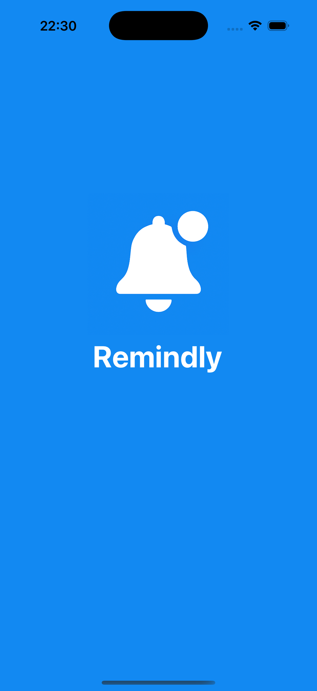
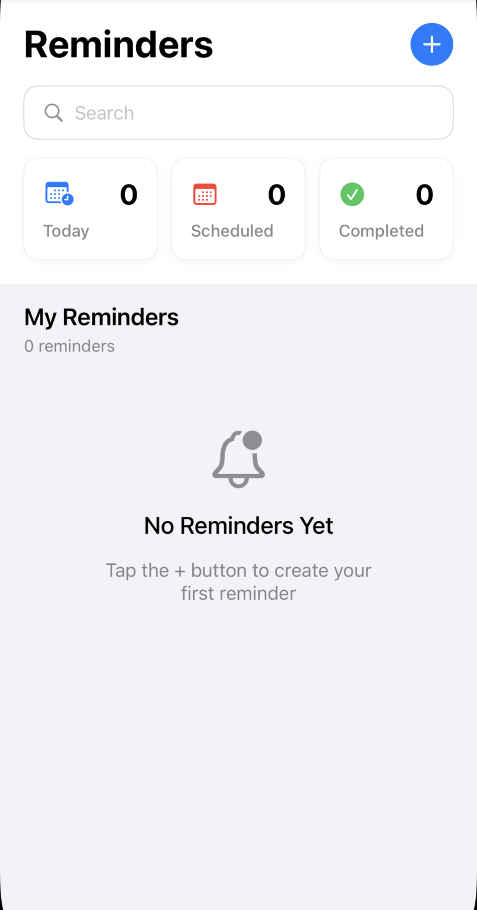
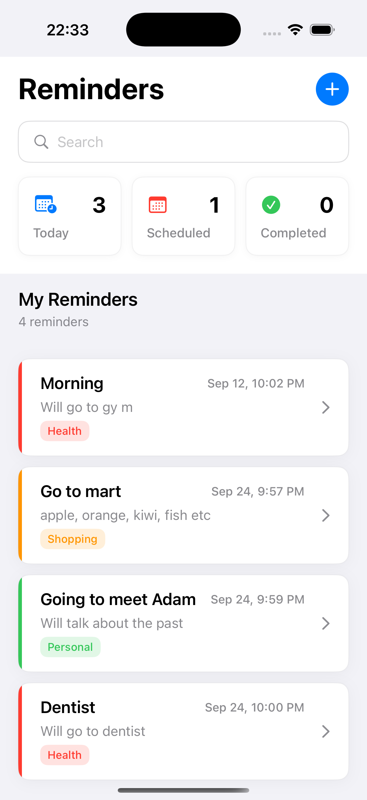
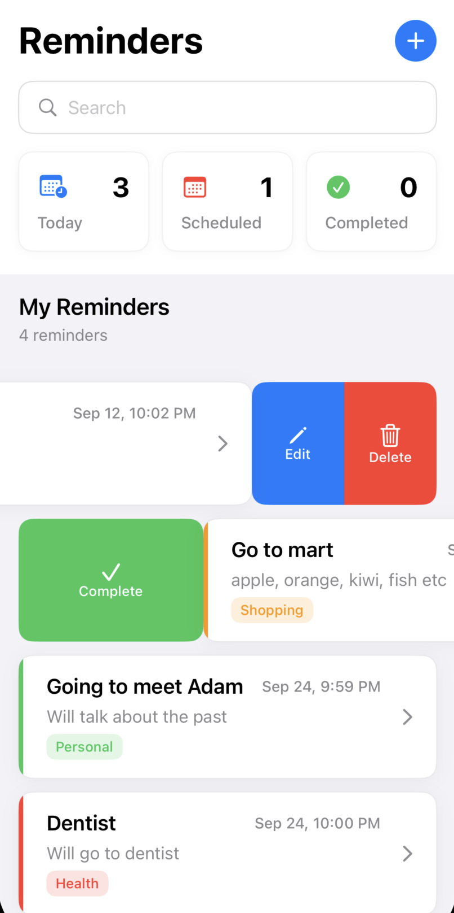
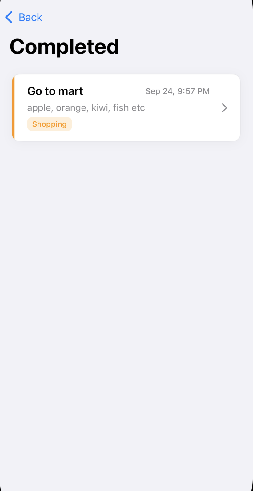
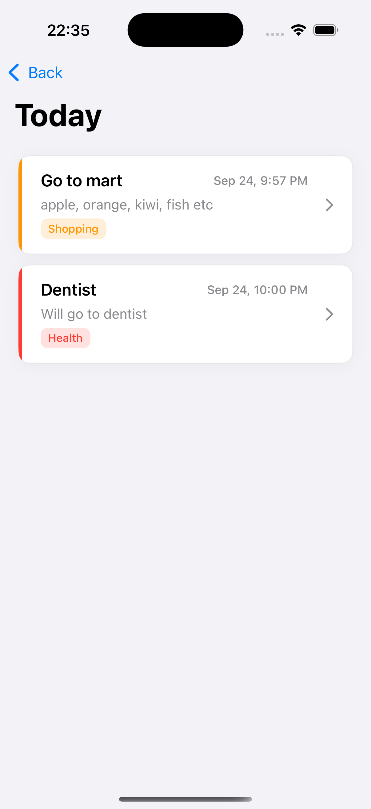
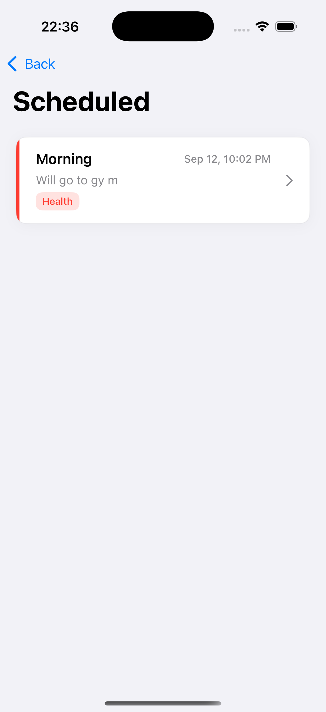
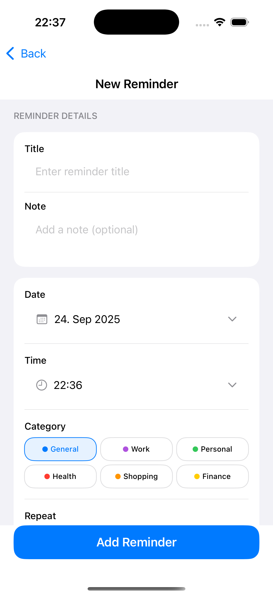
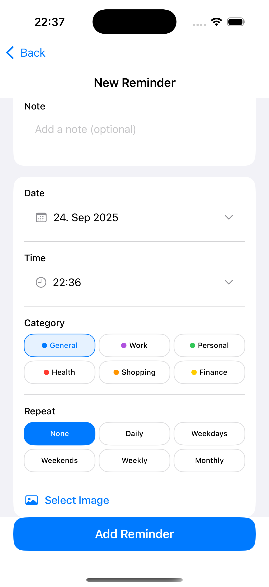

# ⏰ Remindly  

A full fledge **iOS reminder app** built in Swift that helps users stay organized and never miss important tasks.  
Users can add reminders with date, time, and repetition options, and manage them with swipe actions for quick control.  

---

## ✨ Features  
- 🚀 **Launch Screen** — Smooth app launch experience  
- 📋 **Main Dashboard** — Container with 3 sub screen:  
  - ✅ Completed  
  - 📅 Today  
  - 🗓️ Scheduled  
- ➕ **Add New Reminder** — Enter text, set date & time, and choose repetition (daily, weekly, monthly etc.)  
- 🔄 **Swipe Actions** —  
  - Swipe left → Edit or Delete reminder  
  - Swipe right → Mark as Completed  
- 🕒 **Automatic Sorting** — Reminders are categorized into Today, Scheduled, and Completed  

---

## Launch Screen  

  

  

---

## Main Screen  

  
  
  

  

---

## Sub Screen  

  
  
  

  

---

## Adding Remainder Screen  

  
  

  

---

## 🛠️ Technologies Used  
- **Swift (UIKit)**  
- **UserDefaults** (for persistence)  
- **Date & Time Picker**  
- **TableView with Swipe Actions**  

---

